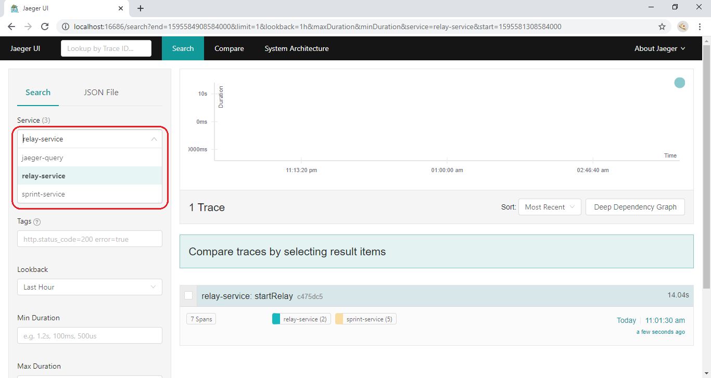
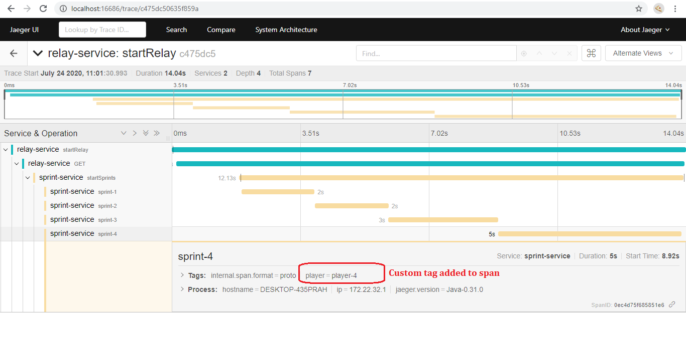

# Jaeger integration with spring boot web application

### Jaeger

Jaeger, inspired by Dapper and OpenZipkin, is a distributed tracing system released as open source by Uber Technologies. It is used for monitoring and troubleshooting microservices-based distributed systems, including:

- Distributed context propagation
- Distributed transaction monitoring
- Root cause analysis
- Service dependency analysis
- Performance / latency optimization

[more info...](https://www.jaegertracing.io/docs/)

### Application overview:  
For this tutorial two microservices are used, namely


* [relay-service](https://github.com/krushnatkhawale/repo.git/relay-service) - A microservice which calls **sprint-service** with a relayId
* [sprint-service](https://github.com/krushnatkhawale/repo.git/sprint-service) - A microservice which executes 4 sprints for provided relayId

Below picture shows how relay-service and sprint-service communicates.


### Jaeger with spring boot

##### Gradle dependencies


##### Tracer configuration

Now before using Jaeger actually, let's have al look at How Jaeger can be configured. First of all a Jaeger tracer needs
to be configured as a bean so that it can simply be @Autowire'd whenever required.

```java
import io.jaegertracing.Configuration;
import org.springframework.boot.web.client.RestTemplateBuilder;
import org.springframework.context.annotation.Bean;
import org.springframework.web.client.RestTemplate;

@org.springframework.context.annotation.Configuration
public class AppConfig {

    @Bean
    public io.opentracing.Tracer initTracer() {
        Configuration.SamplerConfiguration samplerConfig = new Configuration.SamplerConfiguration()
                .withType("const").withParam(1);
        return Configuration.fromEnv("relay-service")
                .withSampler(samplerConfig).getTracer();
    }

    @Bean
    public RestTemplate restTemplate(RestTemplateBuilder restTemplateBuilder) {
        return restTemplateBuilder.build();
    }
}
```
Now that Tracer has been configured, it can easily be added to any class wherever required.

##### Using tracer

The tracer can simply be autowired and used to create spans as be shown below,

```java
        Span sprintSpan = tracer.buildSpan("sprint-" + count)
                .withTag("player", player).start();

        doSomeRunning(player);

        sprintSpan.finish();
```

Line **tracer.buildSpan("sprint-" + count).withTag("player", player).start()** creates a span object.
Note that a custom tag "player" is also being added to the span which can be viewed in Jaeger UI. Finally span can be manually finished.
There is another version of creating span with ```startActive``` method  which supports try with resources(with ```startActive``` method) ie finishes automatically when closes(execution goes out of try block).

Now that configured tracer is used to publish the spans let's have a look at UI to understand how the spans are published and visualized in Jaeger UI.

##### Viewing traces in Jaeger UI

To get the spans published to Jaeger UI we need to hit ```http://localhost:8080/start-relay``` endpoint either by using CURL tool, postman or any web/rest client. The output below is for one hit to the mentioned endpoint.



On the left in the image above(highlighted in red), you can see the list of services that are active and publishing data to the Jaeger collector. As we have two services relay-service and sprint-service for this tutorial both can be seen in the list.

A trace ```relay-service``` can also be seen which has total 7 spans published which is aggregated count(2 for relay-service and 5 for sprint-service).

##### Understanding traces in Jaeger UI

When a tracer is clicked it shows a detailed view of the trace as seen in below view,


There are 2 spans published by relay-service(blue bars) and 5 spans by sprint-service(orange bars). On the left Jaeger shows span hierarchy under single trace which gives understanding of how the spans are related. This view also shows time taken by each span which is helps identifying performance issues.

##### Custom tags in spans

Spring boot by-default adds tags depending upon what type of span being published however the API also provides flexibility to add custom tags. In sprint-service, we are adding a custom tag ```player``` as shown below,

```tracer.buildSpan("sprint-" + count).withTag("player", player).startActive(true)```

which can be viewed in UI by clicking on a specific span that is interested. Below image shows how the tags are displayed,




### Additional Links
Feel free to download code or raising pull requests for improvement. These additional references should also help you:

* [jaeger-installation](https://www.jaegertracing.io/docs/1.18/deployment/)
* [opentracing-spring-jaeger-starter](https://github.com/opentracing-contrib/java-spring-jaeger)